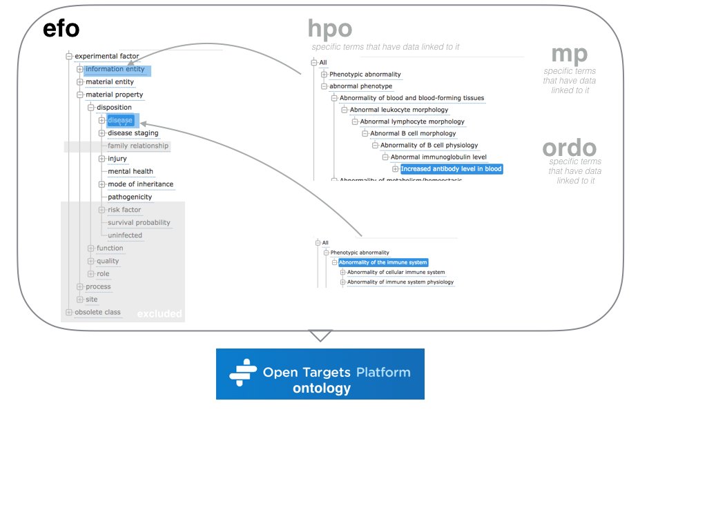

OnToma documentation
====================
OnToma is a Python module which maps the disease or phenotype terms to the ontology used in the Open Targets platform.

The ontology used in the Open Targets platform is a subset (a.k.a. *slim*) of the EFO ontology, *plus* any HPO terms for which a valid EFO mapping could not be found.

This package tries to take the final structure into account and avoids mapping to terms that are not currently in the ontology.

Contents
--------
.. toctree::
   :maxdepth: 2

   usage
   development
   ontoma
   ols
   zooma
   oxo
